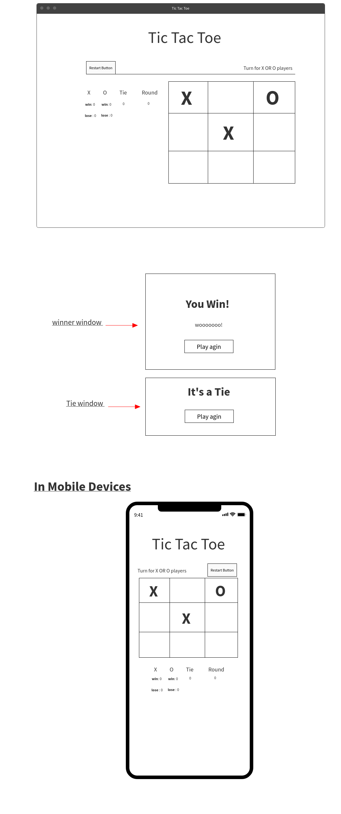

# Tic Tac Toe

## Overview

it is - **a game!** in which two players seek in alternate turns to complete a row, a column, or a diagonal with either three O's or three X's drawn in the spaces of a grid of nine squares.

## Table of content

1. List of technologies used
2. User story
3. Wireframe
4. Development process
5. The winner conditions
6. Future development plan

----------------------------

### List of Technologies

* HTML
* CSS
* JavaScript
* Media Query
* JQuery
* The Dom

### User Stories

* As a user, I should be able to start a new tic tac toe game
* As a user, I should be able to click on a square to add X first and then O, and so on
* As a user, I should be shown a message after each turn for if I win, lose, tie or who's turn it is next
* As a user, I should not be able to click the same square twice
* As a user, I should be shown a message when I win, lose or tie
* As a user, I should not be able to continue playing once I win, lose, or tie
* As a user, I should be able to play the game again without refreshing the page
* Keep track of multiple game rounds with a win, lose and tie counter
* Involve Audio in your game played when user win or tie.
* Make your site fully responsive so that it is playable from a mobile phone
* Get inventive with your styling e.g. use hover effects.

### Development process

First starting with the designing the interfce then start with coding.
Facing some challenging in the design phrase, how to make the flow of the bord and result area, set align in good way. However after some trecks the design fixed.

### The winner conditions

The player win the game when he select a row, colum or across of all cells first. Whenever he wine there is a counter that count the number of win in each round.

### Future development

* Create an **AI** opponent: teach JavaScript to play an unbeatable game against the user.

* add drop list called **Moderate** to let the user select the the level of difficulty when he play agines the computer[Easy - medium - hard].